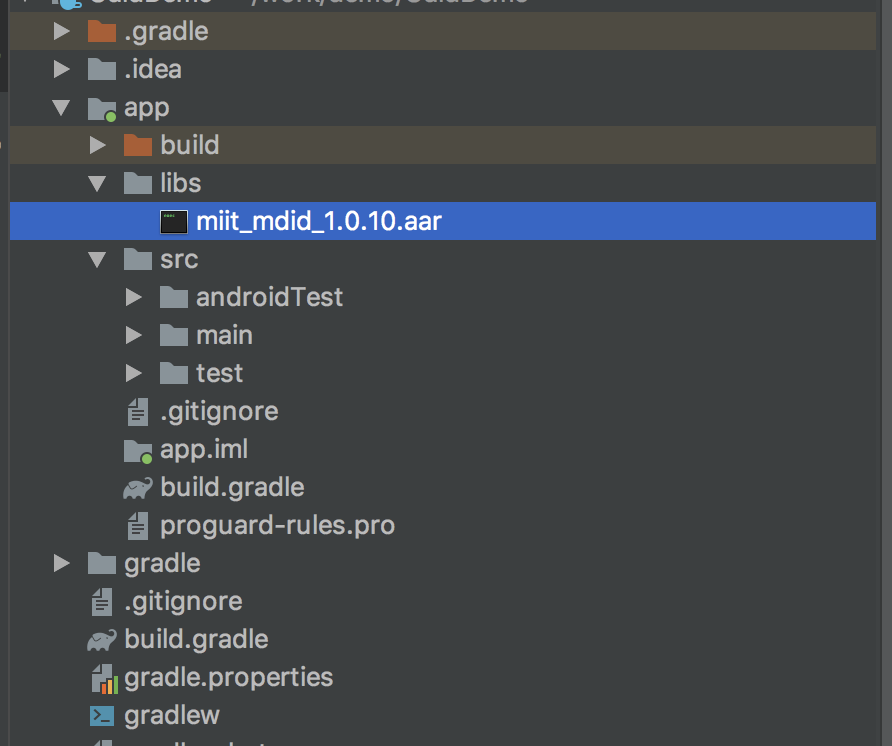
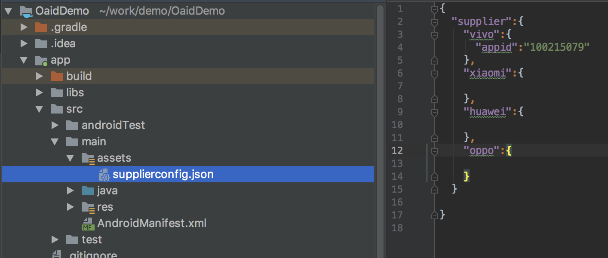
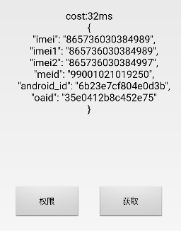

1.把miit_mdid_x.x.x.aar 拷贝到项目的libs目录下，并设置依赖，其中x.x.x代表版本号。（注意，要及时关注移动联盟更新文档，保持版本及时更新）

2.将supplierconfig.json拷贝到项目assets目录下 对应的 id 为应用在应用市场的 id

3.混淆设置

`
-keep class com.bun.miitmdid.core.** {*;}
`

4.代码使用方式参见 Demo

